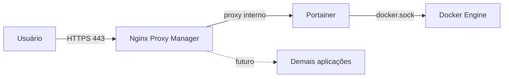

# docker-platform-base

Stack Docker + Portainer + Nginx Proxy Manager para ambiente corporativo, com foco em segurança, governança e backup.

## Visão geral

Este repositório entrega a fundação de uma plataforma de containers:
Docker Engine como runtime, Portainer CE para gerenciamento e
Nginx Proxy Manager como proxy reverso com certificados TLS.

## Arquitetura



## Componentes

| Componente | Função | Porta |
|---|---|---|
| Docker Engine | Runtime de containers | - |
| Portainer CE | Gerenciamento de containers | 9443 |
| Nginx Proxy Manager | Proxy reverso e TLS | 80, 443, 81 (local) |

## Pré-requisitos

- Linux (Ubuntu/Debian recomendado), 2 vCPU, 4 GB RAM
- Portas 80 e 443 liberadas
- Domínio ou DNS interno apontando para o servidor
- Acesso root ou sudo

## Instalação

Resumo do fluxo (detalhes em cada guia):

1. Instalar o Docker: [docs/01-docker.md](docs/01-docker.md)
2. Subir o Portainer: [docs/02-portainer.md](docs/02-portainer.md)
3. Implantar o Nginx Proxy Manager via Portainer: [docs/03-nginx-proxy-manager.md](docs/03-nginx-proxy-manager.md)

## Pós-instalação

Depois que o Portainer e o NPM estiverem no ar, siga esta ordem:

1. Configurar o NPM e trocar as credenciais padrão:
   [docs/03-nginx-proxy-manager.md](docs/03-nginx-proxy-manager.md#primeiro-acesso)
2. Criar o Proxy Host do Portainer com TLS:
   [docs/03-nginx-proxy-manager.md](docs/03-nginx-proxy-manager.md#criar-o-proxy-host-do-portainer)
3. Criar usuários nominais e definir perfis de acesso:
   [docs/02-portainer.md](docs/02-portainer.md#usuários-e-rbac)
4. Aplicar o hardening (fechar a porta 9443 e restringir a porta 81):
   [docs/02-portainer.md](docs/02-portainer.md#segurança) e
   [docs/03-nginx-proxy-manager.md](docs/03-nginx-proxy-manager.md#segurança)

## Atualização

1. Fazer backup dos volumes
2. Alterar a versão da imagem (variável `NPM_VERSION` na stack, ou tag do
   Portainer no `docker run`)
3. NPM: **Stacks → Update the stack → Pull and redeploy**
4. Portainer: `docker pull`, remover o container e recriar com o mesmo volume

## Estrutura do repositório

```
├── docs/                          # documentação detalhada de cada componente
│   ├── 01-docker.md
│   ├── 02-portainer.md
│   └── 03-nginx-proxy-manager.md
├── stacks/
│   └── nginx-proxy-manager/       # stack implantada via Portainer
│       ├── docker-compose.yml
│       └── .env.example
├── daemon.json.example            # configuração recomendada do Docker Engine
├── .gitignore
└── LICENSE
```

## Roadmap

- [x] Docker + Portainer + Nginx Proxy Manager
- [ ] Authentik (SSO)
- [ ] Vaultwarden
- [ ] Zabbix + Grafana
- [ ] GLPI, Wiki, Mattermost

## Licença

Distribuído sob a licença MIT. Veja o arquivo [LICENSE](LICENSE).
