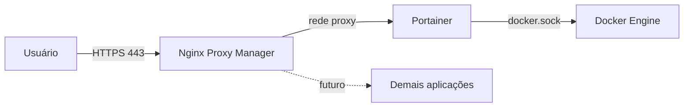

# docker-platform-base
Stack Docker + Portainer + Nginx Proxy Manager para ambiente corporativo, com foco em segurança, governança e backup.

## Visão geral
Este repositório entrega a fundação de uma plataforma de containers:
Docker Engine como runtime, Portainer CE para gerenciamento e
Nginx Proxy Manager como proxy reverso com certificados TLS.

## Arquitetura

## Componentes

| Componente | Função | Porta |
|---|---|---|
| Docker Engine | Runtime de containers | - |
| Portainer CE | Gerenciamento de containers | 9443 |
| Nginx Proxy Manager | Proxy reverso e TLS | 80, 443, 81 (local) |

## Pré-requisitos

- Linux (Ubuntu/Debian recomendado), 2 vCPU, 4 GB RAM
- Portas 80 e 443 liberadas
- Domínio ou DNS interno apontando para o servidor
- Acesso root ou sudo

## Instalação

Resumo do fluxo (detalhes em cada guia):

1. Instalar o Docker: [docs/01-instalacao-docker.md](docs/01-instalacao-docker.md)
2. Criar a rede `proxy` e subir o Portainer: [docs/03-portainer-setup.md](docs/03-portainer-setup.md)
3. Implantar o Nginx Proxy Manager via Portainer: [docs/04-nginx-proxy-manager.md](docs/04-nginx-proxy-manager.md)
4. Aplicar o hardening: [docs/05-seguranca.md](docs/05-seguranca.md)

## Pós-instalação

Depois que o Portainer e o NPM estiverem no ar, siga esta ordem:

1. Configurar o NPM e trocar as credenciais padrão:
   [docs/04-nginx-proxy-manager.md](docs/04-nginx-proxy-manager.md)
2. Criar o Proxy Host do Portainer com TLS:
   [docs/04-nginx-proxy-manager.md](docs/04-nginx-proxy-manager.md#proxy-host-do-portainer)
3. Criar usuários nominais e definir perfis de acesso:
   [docs/03-portainer-setup.md](docs/03-portainer-setup.md#6-usuários-times-e-rbac)
4. Aplicar o hardening (fechar a porta 9443 e revisar o `docker.sock`):
   [docs/05-seguranca.md](docs/05-seguranca.md)

## Atualização

1. Fazer backup dos volumes
2. Alterar a versão da imagem (variável `NPM_VERSION` na stack, ou tag do
   Portainer no `docker run`)
3. NPM: **Stacks → Update the stack → Pull and redeploy**
4. Portainer: `docker pull`, remover o container e recriar com o mesmo volume

## Licença

Distribuído sob a licença MIT. Veja o arquivo [LICENSE](LICENSE).
