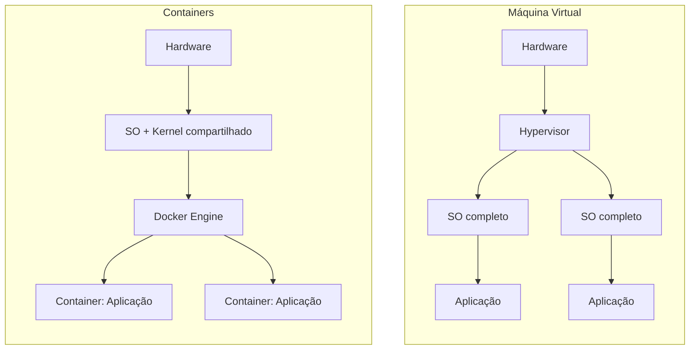

# Docker: conceitos, instalação e boas práticas

## Parte 1: O que é o Docker
Docker é uma plataforma que permite empacotar uma aplicação junto com tudo que ela precisa para rodar (bibliotecas, dependências, configurações) em uma unidade chamada container. Esse container roda de forma isolada, mas compartilha o kernel do sistema operacional do host, o que o torna muito mais leve do que uma máquina virtual tradicional.

### Conceitos-chave
| Termo | O que é |
|---|---|
| Imagem | Um "molde" somente leitura com tudo que a aplicação precisa (sistema base, dependências, código). Serve de ponto de partida para criar containers. |
| Container | Uma instância em execução de uma imagem. É isolado, mas leve, e pode ser criado, parado e destruído rapidamente. |
| Dockerfile | Arquivo de texto com as instruções para construir uma imagem. |
| Volume | Espaço de armazenamento persistente, usado para guardar dados que não podem se perder quando o container é recriado. |
| Rede (network) | Camada que permite (ou restringe) a comunicação entre containers. |
| Docker Compose | Ferramenta para definir e subir múltiplos containers relacionados a partir de um único arquivo (`docker-compose.yml`). |
| Docker Engine | O motor que executa e gerencia os containers no host. |

### Por que usar Docker

- **Portabilidade**: a aplicação roda do mesmo jeito no notebook do desenvolvedor, no servidor de teste e em produção.
- **Isolamento**: cada aplicação tem suas próprias dependências, sem conflitar com outras no mesmo host.
- **Leveza**: containers compartilham o kernel do host, então sobem em segundos e consomem menos recursos que VMs.
- **Padronização**: facilita replicar ambientes e automatizar implantações.

### Container vs. máquina virtual



Cada VM carrega um sistema operacional inteiro; os containers compartilham o kernel do host e isolam só a aplicação, o que os torna mais rápidos de iniciar e mais econômicos em recursos.

## Parte 2: Instalação
### Visão geral

O Docker Engine é o runtime de containers desta plataforma. A instalação segue o repositório oficial da Docker, não o pacote `docker.io` do repositório padrão do Ubuntu, que costuma ficar desatualizado.

### Pré-requisitos

- Ubuntu Server 22.04 ou 24.04 LTS
- Acesso root ou sudo
- Conexão com a internet

### Remover versões antigas (se existirem)

```bash
sudo apt remove docker docker-engine docker.io containerd runc
```
### Instalar o Docker Engine
- **Passo 1:** Instalar as dependências
  ```bash
  sudo apt update # atualiza a lista de pacotes do Ubuntu
  sudo apt install -y ca-certificates curl gnupg # permite ao APT o uso de pacotes seguros HTTPS
  ```
- **Passo 2:** Adicionar chave GPG e repositório Docker ao Ubuntu
  ```bash
  curl -fsSL https://download.docker.com/linux/ubuntu/gpg | sudo gpg --dearmor -o /usr/share/keyrings/docker-archive-keyring.gpg # adiciona a chave GPG para garantir a validade dos pacotes do repositório oficial
  echo "deb [arch=$(dpkg --print-architecture) signed-by=/usr/share/keyrings/docker-archive-keyring.gpg] https://download.docker.com/linux/ubuntu $(lsb_release -cs) stable" | sudo tee /etc/apt/sources.list.d/docker.list > /dev/null # adiciona o repositório do Docker às fontes de pacotes do Ubuntu
  sudo apt update # atualiza novamente a lista de pacotes
    ```  
- **Passo 3:** Instalar o Docker
  ```bash
  sudo apt install docker-ce # instala o docker
  sudo systemctl status docker # exibe o status 
  docker --version # exibe a versão
  ```

## Parte 3: Boas práticas

