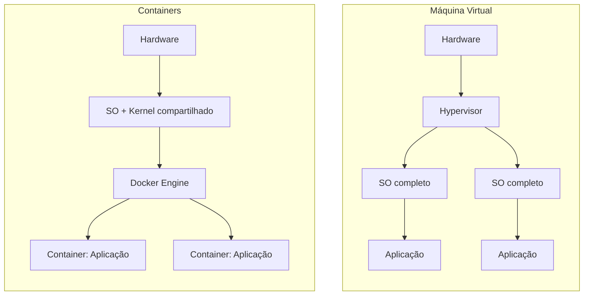

# Docker: conceitos, instalação, comandos e boas práticas

## Parte 1: O que é o Docker
Docker é uma plataforma que permite empacotar uma aplicação junto com tudo que ela precisa para rodar (bibliotecas, dependências, configurações) em uma unidade chamada container. Esse container roda de forma isolada, mas compartilha o kernel do sistema operacional do host, o que o torna muito mais leve do que uma máquina virtual tradicional.

### Conceitos-chave
| Termo | O que é |
|---|---|
| Imagem | Um "molde" somente leitura com tudo que a aplicação precisa (sistema base, dependências, código). Serve de ponto de partida para criar containers. |
| Container | Uma instância em execução de uma imagem. É isolado, mas leve, e pode ser criado, parado e destruído rapidamente. |
| Dockerfile | Arquivo de texto com as instruções para construir uma imagem. |
| Volume | Espaço de armazenamento persistente, usado para guardar dados que não podem se perder quando o container é recriado. |
| Rede (network) | Camada que permite (ou restringe) a comunicação entre containers. |
| Docker Compose | Ferramenta para definir e subir múltiplos containers relacionados a partir de um único arquivo (`docker-compose.yml`). |
| Docker Engine | O motor que executa e gerencia os containers no host. |

### Por que usar Docker

- **Portabilidade**: a aplicação roda do mesmo jeito no notebook do desenvolvedor, no servidor de teste e em produção.
- **Isolamento**: cada aplicação tem suas próprias dependências, sem conflitar com outras no mesmo host.
- **Leveza**: containers compartilham o kernel do host, então sobem em segundos e consomem menos recursos que VMs.
- **Padronização**: facilita replicar ambientes e automatizar implantações.

### Container vs. máquina virtual



Cada VM carrega um sistema operacional inteiro; os containers compartilham o kernel do host e isolam só a aplicação, o que os torna mais rápidos de iniciar e mais econômicos em recursos.

## Parte 2: Instalação
### Visão geral

O Docker Engine é o runtime de containers desta plataforma. A instalação segue o repositório oficial da Docker, não o pacote `docker.io` do repositório padrão do Ubuntu, que costuma ficar desatualizado.

### Pré-requisitos

- Ubuntu Server 22.04 ou 24.04 LTS
- Acesso root ou sudo
- Conexão com a internet

### Remover versões antigas (se existirem)

```bash
sudo apt remove docker docker-engine docker.io containerd runc
```
### Instalar o Docker Engine
- **Passo 1:** Instalar as dependências
  ```bash
  sudo apt update # atualiza a lista de pacotes do Ubuntu
  sudo apt install -y ca-certificates curl gnupg # permite ao APT o uso de pacotes seguros HTTPS
  ```
- **Passo 2:** Adicionar chave GPG e repositório Docker ao Ubuntu
  ```bash
  curl -fsSL https://download.docker.com/linux/ubuntu/gpg | sudo gpg --dearmor -o /usr/share/keyrings/docker-archive-keyring.gpg # adiciona a chave GPG para garantir a validade dos pacotes do repositório oficial
  echo "deb [arch=$(dpkg --print-architecture) signed-by=/usr/share/keyrings/docker-archive-keyring.gpg] https://download.docker.com/linux/ubuntu $(lsb_release -cs) stable" | sudo tee /etc/apt/sources.list.d/docker.list > /dev/null # adiciona o repositório do Docker às fontes de pacotes do Ubuntu
  sudo apt update # atualiza novamente a lista de pacotes
    ```  
- **Passo 3:** Instalar o Docker
  ```bash
  sudo apt install docker-ce # instala o docker
  sudo systemctl status docker # exibe o status 
  docker --version # exibe a versão
  ```

## Parte 3: Comandos

### Comandos básicos
```bash
docker --version              # Mostra a versão instalada do Docker
docker info                   # Exibe informações detalhadas sobre o Docker
docker help                   # Lista os comandos disponíveis
```
### Gerenciamento do serviço
```bash
systemctl start docker        # Inicia o serviço do Docker
systemctl enable docker       # Configura o Docker para iniciar automaticamente junto com o sistema operacional
systemctl status docker       # Exibe o status atual do serviço
```

### Imagens
```bash
docker pull <imagem>          # Baixa uma imagem do Docker Hub
docker images                 # Lista as imagens disponíveis localmente
docker rmi <imagem>           # Remove uma imagem
docker build -t nome:tag .    # Cria uma imagem a partir de um Dockerfile
```

### Contêineres
```bash
docker run <imagem>           # Cria e executa um contêiner
docker run -it <imagem> bash  # Executa um contêiner interativo com bash
docker ps                     # Lista contêineres em execução
docker ps -a                  # Lista todos os contêineres (inclusive parados)
docker stop <id>              # Para um contêiner
docker start <id>             # Inicia um contêiner parado
docker restart <id>           # Reinicia um contêiner
docker rm <id>                # Remove um contêiner parado
```

### Volumes (dados)
```bash
docker volume ls              # Lista volumes
docker volume create nome     # Cria um volume
docker volume rm nome         # Remove um volume
```

### Logs e Execução
```bash
docker logs <id>              # Exibe os logs de um contêiner
docker exec -it <id> bash     # Acessa um contêiner em execução
```

### Redes
```bash
docker network ls             # Lista redes
docker network create nome    # Cria uma rede
docker network rm nome        # Remove uma rede
```

### Limpeza
```bash
docker system prune           # Remove contêineres, imagens e redes não usados
docker image prune            # Remove apenas imagens não utilizadas
```

## Parte 4: Boas práticas

### Configuração do daemon
Arquivo `/etc/docker/daemon.json` (exemplo em
[`docker/daemon.json.example`](../docker/daemon.json.example)):

```json
{
  "log-driver": "json-file",
  "log-opts": {
    "max-size": "10m",
    "max-file": "3"
  },
  "live-restore": true
}
```

Aplicar:

```bash
sudo systemctl restart docker
```

| Opção | Motivo |
|---|---|
| `log-opts` | Evita que logs de containers encham o disco |
| `live-restore` | Mantém os containers rodando durante um restart do daemon |

### Rede
- Redes nomeadas por função, nunca a `bridge` padrão para produção
- Ex.: `proxy` (exposta ao NPM), `internal` (bancos de dados, sem acesso externo)
- Evitar publicar portas de serviços que só devem ser acessados via proxy

### Volumes
- Preferir **volumes nomeados** (`docker volume create`) a bind mounts,
  exceto quando o objetivo é editar arquivos de configuração do host
- Nomear pelo padrão `<servico>_data`, `<servico>_config`

### Versionamento de imagens
- Nunca usar `latest` em produção
- Fixar a tag (ex.: `portainer-ce:2.21.5`)
- Documentar a versão em uso no `.env.example` de cada stack
- Atualizar de forma deliberada, com backup antes

### Usuário não-root
Quando a imagem permitir, rodar como usuário sem privilégios:

```yaml
user: "1000:1000"
```

### Limites de recursos
```yaml
deploy:
  resources:
    limits:
      cpus: "1.0"
      memory: 512M
```

Evita que um container consuma todos os recursos do host.
